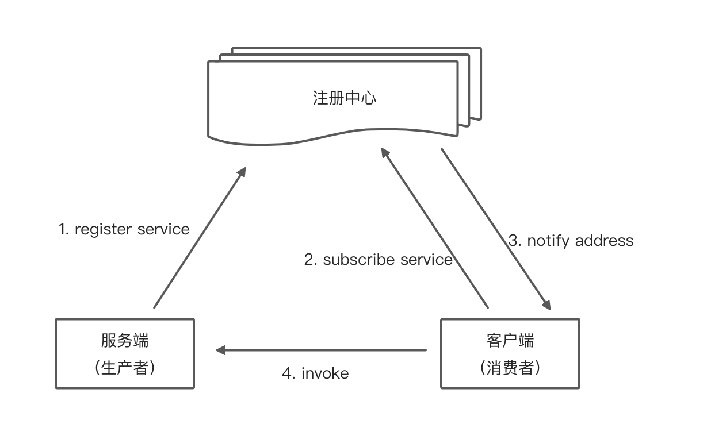

# Hikari-RPC

## 概述
Hikari-RPC 是一个学习了解 RPC 简单框架，同时也是一个支持高扩展性的 Java RPC 框架。



## 特点
- 无代码入侵，高性能远程服务调用
- 支持多个服务注册表
- 集成常用组件 zookeeper
- 高可扩展性，可根据需要轻松改进功能

## 需要
编译需要 JDK 8 及以上、Maven 3.2.5 及以上。  
运行需求 JDK 8 及以上。

## 快速开始

### 服务端（生产者）
```java
interface ExampleService {
    String sayHello();
    
    // ...
}

@HikariRpcService(ExampleService.class)
class ExampleServiceImpl implements ExampleService {
    @Override
    public String sayHello() {
        return "Hello, Hikari-RPC";
    }
    
    // ...
}
```
配置信息：
```yaml
# hikari-rpc config
hikari:
  rpc:
    register-address: 127.0.0.1:2181
    server-name: provider
    timeout: 2000
    host: 127.0.0.1
    port: ${server.port}
```

### 客户端（消费者）
```java
class ExampleController {

    @HikariRpcConsumer(providerName = "provider")
    private ExampleService exampleService;

    @GetMapping("sayHello")
    public String sayHello() {
        return exampleService.sayHello();
    }
    
    // ...
}
```
配置信息：
```yaml
# hikari-rpc config
hikari:
  rpc:
    register-address: 127.0.0.1:2181
    server-name: consumer
    timeout: 2000
```


## 我的计划
- 1、集成 SpringBoot，提供方和消费方统一用注解注入 ✅
- 2、集成注册中心，使用 zookeeper 作为注册中心 ✅
- 3、支持序列化算法：json，protostuff ✅
- 4、实现常见的负载均衡策略，如：轮询、权重轮询、一致性哈希等（进行中）
- 5、实现心跳机制
- 6、支持重试策略


## 架构图
> 这里需要一个架构图例说明 =。=

